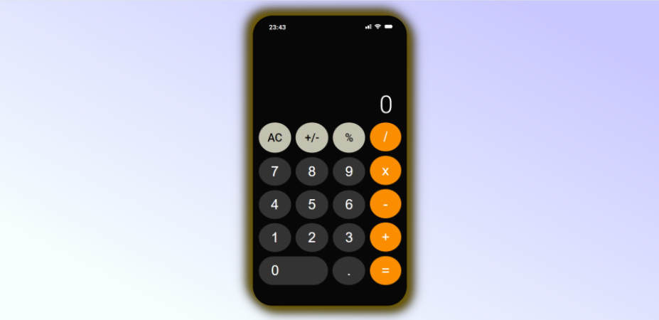
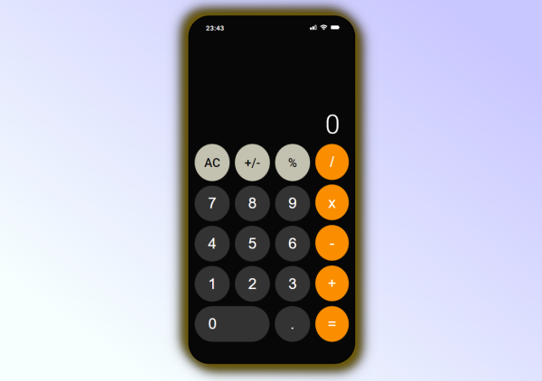
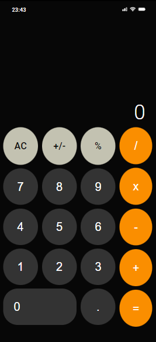

# Calculator 

### Description

*This is pet-project represents Calculator web-application.* In the web-app you can calculate simple ariphmetic tasks, e.g. sum, subtract, multiply, divisioning, counting percentage. 
<b>Input is available by both: mouse and keyboard.</b>
 
During the project I used HTML, CSS, Flexbox, JavaScript technologies and tools.
This web page is fully adaptive for all devices. Below you can see screenshots of desktop, tablet and mobile versions.

### Preview

 
 

